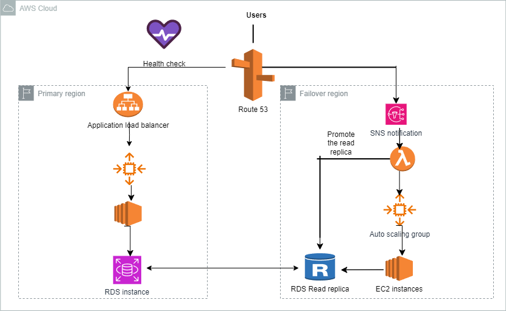

# **AWS automatic Failover (Terraform deployment)**
## **Table of Contents**
- [Project Purpose](#project-purpose)
- [Architecture Overview](#architecture-overview)
- [Features](#features)
- [Prerequisites](#prerequisites)
- [Deployment Instructions](#deployment-instructions)
- [Project Structure](#project-structure)
- [Usage](#usage)
- [License](#license)
- [Contact](#Contact)
---

This project presents the case of a  company that has a multi-tier web application that runs on a fleet of Amazon EC2 instances behind an Application Load Balancer (ALB). The instances are in an Auto Scaling group. The ALB and the Auto Scaling group are replicated in a backup AWS Region. The minimum value and the maximum value for the Auto Scaling group are set to zero. An Amazon RDS Multi-AZ DB instance stores the application’s data. The DB instance has a read replica in the backup Region. The application presents an endpoint to end users by using an Amazon Route 53 record. The company needs to reduce its RTO to less than 15 minutes by giving the application the ability to automatically fail over to the backup Region. The company does not have a large enough budget for an active-active strategy.
The team of solution architects has decided to:
- Create an AWS Lambda function in the backup Region to promote the read replica and modify the Auto Scaling group values.
- Configure Route 53 with a health check that monitors the web application and sends an Amazon Simple Notification Service (Amazon SNS) notification to the Lambda function when the health check status is unhealthy.
- Update the application’s Route 53 record with a failover policy that routes traffic to the ALB in the backup Region when a health check failure occurs.

The goal of this project is to realize this architecture and deploy it using terraform.

The purpose of this project is to implement a highly available web application architecture that can fail over between two AWS regions. The architecture includes: 
- **EC2 instances** in an **Auto Scaling Group**. 
- **Application Load Balancer (ALB)** to distribute traffic. 
- **Amazon RDS (Multi-AZ)** with a read replica in a backup region.
 - **AWS Lambda** to promote the RDS read replica and scale EC2 instances in the backup region. 
- **Amazon Route 53** for DNS resolution with a health check mechanism to detect failures and trigger failover.

 When a failure is detected in the primary region, the system automatically switches to the backup region without manual intervention, maintaining service availability.

---
## **Architecture Overview**

---
## **Features**
- **Primary and Backup Regions**: The application is deployed in two AWS regions, with a full replication of critical services (EC2, RDS, etc.).
- **Route 53 DNS Failover**: Health checks are continuously monitored by Route 53, which automatically reroutes traffic to the backup region when the primary region becomes unhealthy.
- **Auto Scaling**: EC2 instances are automatically scaled based on demand in both regions.
- **RDS Failover**: In the event of a failure, AWS Lambda promotes a read replica in the backup region to become the primary database.

---
## **Prerequisites**
Before deploying this project, ensure you have the following installed:
1. An AWS account with necessary permissions to create resources like EC2, ALB, RDS, Route 53, SNS, Lambda, etc.
2. Terraform installed locally (v1.0 or higher).
3. AWS CLI configured with access keys.
---

## **AWS Permissions Required**
- IAM permissions to create and manage resources such as EC2, RDS, Lambda, Route 53, and SNS.
- Access to the S3 bucket for Lambda function deployment if using zipped code.

---
## **Deployment instructions**
1.  **Clone the repository**
```bash
git clone [https://github.com/narcissenjeufack/aws-failover-api.git](https://github.com/narcissenjeufack/aws-automatic-failover-with-terraform-deployment)
cd aws-failover-api
```
2. **Configure variables**
Update the `variables.tf` files in the root and modules with your desired values (e.g., regions, table names, domain name).
3. **Initialize terraform**
`terraform init`
4. **Plan and Apply the Configuration**
```bash
terraform plan
terraform apply
```
5.  **Verify the deployment**
- Check Route 53 failover records.
- Access the primary and secondary API endpoints.
---
## **Project structure**
```
aws-automatic-failover/
├── modules/
│   ├── ec2/
│   │   ├── main.tf
│   │   ├── variables.tf
│   │   ├── outputs.tf
│   ├── rds/
│   │   ├── main.tf
│   │   ├── variables.tf
│   │   ├── outputs.tf
│   ├── route53/
│   │   ├── main.tf
│   │   ├── variables.tf
│   │   ├── outputs.tf
│   ├── lambda/
│   │   ├── main.tf
│   │   ├── variables.tf
│   │   ├── outputs.tf
│   │   ├── failover_function.py
│   │   ├── failover_function.zip
├── main.tf
├── variables.tf
├── outputs.tf
├── README.md

```
---

## **Components:**
- **Amazon EC2:** Auto Scaling group to handle application traffic.
- **Application Load Balancer (ALB):** Distributes traffic to EC2 instances.
- **Amazon RDS (Multi-AZ):** Provides database failover capabilities across regions.
- **AWS Lambda:** Promotes RDS read replica and adjusts the Auto Scaling group settings in the backup region.
- **Route 53:** Manages DNS records, routing traffic based on health checks.
- **SNS:** Sends notifications to Lambda on health check failure.
---

**Workflow:**
1. Users access the application via a Route 53 DNS record pointing to the ALB in the primary region.
2. Route 53 monitors the health of the primary region via HTTP health checks.
3. If a failure is detected, Route 53 triggers an SNS notification to a Lambda function in the backup region.
4. The Lambda function promotes the RDS read replica to primary and adjusts the Auto Scaling group to scale EC2 instances in the backup region.
5. Route 53 updates its DNS routing to direct traffic to the backup region's ALB.

---
## **Deployment flow**
1. User Request: Users access the application via Route 53 DNS.
2. Primary Region: Route 53 directs traffic to the  ALB in the primary region.
3. Health Check Failure: If the health check fails, Route 53 triggers an SNS notification.
4. Failover Process: Lambda function promotes the RDS read replica and scales EC2 instances in the backup region.
5. Traffic Routing: Route 53 switches traffic to the backup region's ALB.


---
## **License **
This project is licensed under the MIT License. See the LICENSE file for details.
---
## **Contact**
For issues or suggestions, please create a GitHub issue or contact me at njeufacknarcisse1@gmail.com.
